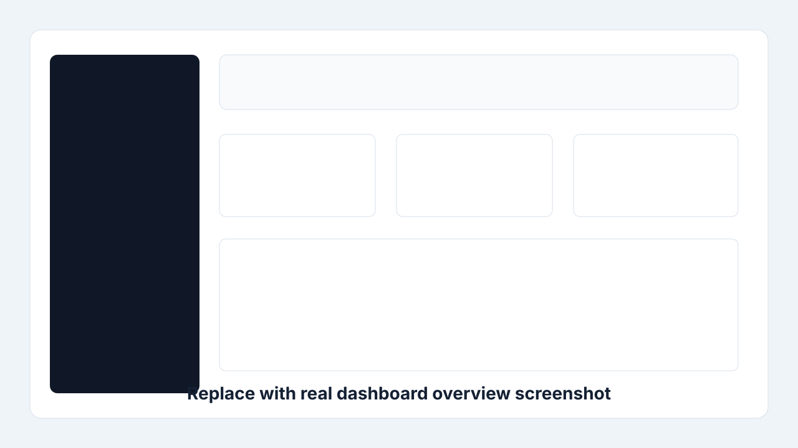
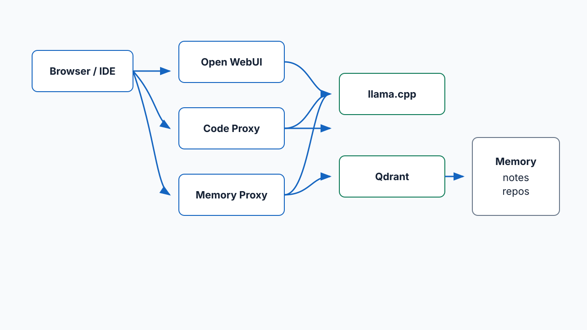
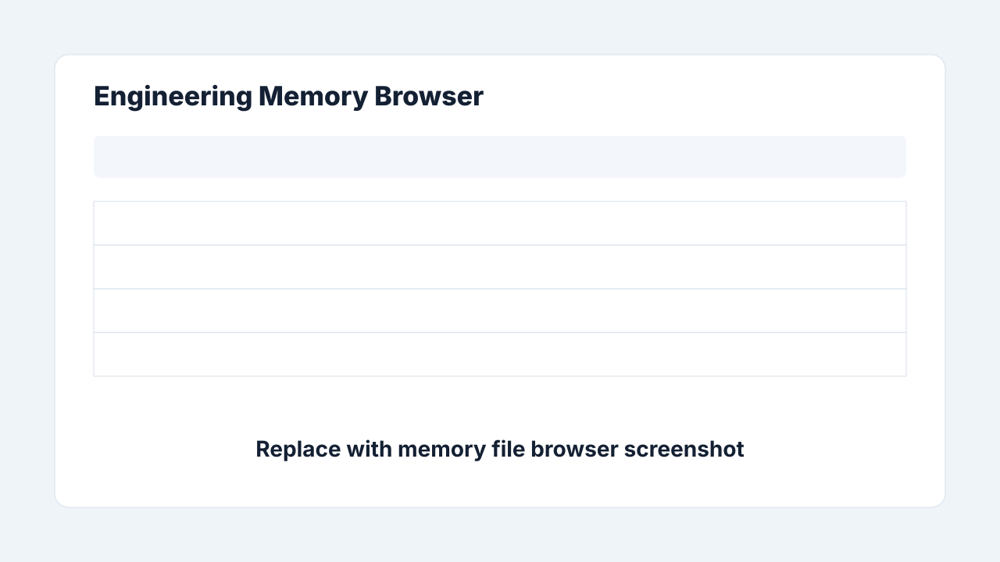
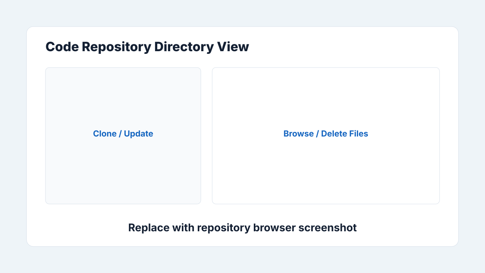
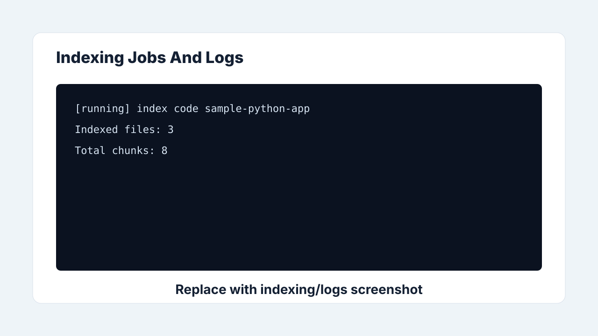

# AI Stack VM - Private Local RAG System

A self-hosted AI assistant stack for local model serving, Open WebUI, and
retrieval-augmented generation over engineering notes and code repositories.

The main entry point is the `./ai-stack` helper. It creates the runtime
directories, writes local env files, downloads/points at a GGUF model, builds the
container images, and starts the compose stack.

## Architecture

```text
Container host / VM
|-- vm-llama      llama.cpp OpenAI-compatible server -> http://localhost:8082/v1
|-- qdrant        vector database                    -> http://localhost:6333
|-- memory-proxy  engineering-memory RAG proxy       -> http://localhost:9002/v1
|-- code-proxy    code-memory RAG proxy              -> http://localhost:9001/v1
|-- open-webui    browser chat UI                    -> http://localhost:8080
`-- dashboard     management website/API            -> http://localhost:9100
```

Optional laptop flow:

```text
Laptop Continue.dev / browser
  -> localhost ports, direct VM access, or OpenShift port-forward
  -> vm-llama / memory-proxy / code-proxy / Open WebUI
```

## Portfolio Preview

> Media below uses committed placeholders until real screenshots and a short
> demo capture are recorded from a running VM deployment.



### Architecture Diagram



Diagram source: [`docs/media/architecture-diagram.mmd`](docs/media/architecture-diagram.mmd)

### Screenshots

| Area | Preview |
|---|---|
| Dashboard overview |  |
| Memory file browser |  |
| Repository browser |  |
| Indexing and logs |  |

### Short Demo Video


Replace this placeholder with a short GIF or video showing: stack status,
repository browsing, indexing, and a RAG question answered through Open WebUI.

## Why This Project Matters

AI Stack VM packages a private, OpenAI-compatible local AI environment that can
run on a VM, serve a local model, index engineering notes and code repositories,
and expose the result through familiar tools such as Open WebUI and Continue.dev.
It is designed for teams or individuals who want useful RAG workflows without
sending private code or notes to hosted services.

## Problems Solved

- Gives local models a practical OpenAI-compatible surface for chat tools.
- Adds memory and code retrieval around private engineering context.
- Keeps runtime data in predictable VM folders under `$AI_STACK_HOME`.
- Provides a dashboard for health checks, logs, uploads, repo cloning, indexing,
  and safe file cleanup.
- Defaults to safer binding, optional bearer auth, and rate limiting for exposed
  proxy endpoints.

## Benchmarks

Example placeholders until measured on a specific VM:

| Scenario | Latency | RAM | Indexing speed | Notes |
|---|---:|---:|---:|---|
| llama.cpp `/v1/models` health check | TBD | TBD | n/a | Replace with dashboard measured latency. |
| Short chat completion | TBD | TBD | n/a | Record model, context, and token count. |
| Engineering memory indexing | n/a | TBD | TBD files/min | Measure with `./ai-stack index memory`. |
| Code repository indexing | n/a | TBD | TBD files/min | Measure with `./ai-stack index code <repo>`. |
| Dashboard refresh | TBD | TBD | n/a | Use browser plus `/api/dashboard/status`. |

## Future Roadmap

- Real screenshots and a short demo GIF/video from the OpenShift route.
- Recursive repository deletion with stronger safeguards and typed confirmation.
- Per-service API keys and dashboard authentication.
- Qdrant cleanup helpers for deleted demo files or removed repositories.
- Measured benchmark automation exported into README-ready tables.

## Runtime Data Layout

By default `./ai-stack init` uses `AI_STACK_HOME=$HOME/ai-stack`.

```text
$AI_STACK_HOME/
|-- models/                         GGUF model files
`-- memory/
    |-- engineering-memory/          markdown notes, architecture docs, personas
    `-- code-memory/                 cloned or synced project repos for code RAG
```

The repository also has local placeholder folders (`models/`, `qdrant/`,
`open-webui/`, `python-envs/`) with README files, but compose uses named
container volumes for Qdrant/Open WebUI data and `$AI_STACK_HOME` for models and
memory.

## Ports

| Service | Port | Notes |
|---|---:|---|
| Open WebUI | 8080 | Browser chat UI |
| laptop-llama | 8081 | Optional laptop GPU model |
| vm-llama | 8082 | llama.cpp server from `docker-compose.yml` |
| Qdrant REST | 6333 | Vector database |
| Qdrant gRPC | 6334 | Qdrant default gRPC port, not published by current compose |
| code-proxy | 9001 | OpenAI-compatible code RAG proxy |
| memory-proxy | 9002 | OpenAI-compatible memory RAG proxy |
| dashboard | 9100 | Optional management website and status API |

## Prerequisites

- Bash-compatible shell, such as Linux, WSL, Git Bash, or a Linux VM.
- Docker with Docker Compose, or Podman with `podman compose` / `podman-compose`.
- `git`, `curl`, and `awk`.
- Python 3.11+ if you want to run the indexing/search scripts directly on the
  host.
- Optional: OpenShift `oc` CLI for port-forwarding from an OpenShift/KubeVirt VM.

## Quick Start

For a personal laptop-class profile, such as 12 cores, 16 GB RAM, and about 6 GB
VRAM, the helper defaults to:

`Qwen2.5-Coder-3B-Instruct-Q4_K_M.gguf`

```bash
git clone <repo-url> ai-stack-vm
cd ai-stack-vm
chmod +x ./ai-stack

./ai-stack install
```

The installer checks dependencies and system resources, recommends a model,
updates `.env` safely, downloads the model when a URL is configured, builds the
images, starts the services, and runs status checks.

Manual setup is still available:

```bash
./ai-stack doctor
./ai-stack init
./ai-stack profile laptop
./ai-stack model download
./ai-stack build
./ai-stack up
./ai-stack status
```

For an OpenShift/VM-style 16 CPU profile:

```bash
./ai-stack profile vm16
./ai-stack model download
./ai-stack build
./ai-stack up
```

For the larger 60-core / 40 GB RAM profile:

```bash
./ai-stack profile vm60
# Edit MODEL_URL in .env, or pass the larger GGUF URL directly:
./ai-stack model download <model-url>
./ai-stack build
./ai-stack up
```

Useful daily commands:

```bash
./ai-stack status
./ai-stack logs llama
./ai-stack logs code
./ai-stack logs memory
./ai-stack restart
./ai-stack down
```

## CLI Reference

```text
./ai-stack doctor
./ai-stack install
./ai-stack init
./ai-stack profile laptop|vm16|vm60
./ai-stack model list
./ai-stack model path
./ai-stack model use <file.gguf>
./ai-stack model download [url]
./ai-stack build
./ai-stack up
./ai-stack dashboard
./ai-stack down
./ai-stack restart
./ai-stack status
./ai-stack logs [llama|qdrant|code|memory|webui|dashboard|all]
./ai-stack index memory
./ai-stack index code <repo-path>
./ai-stack search code "query"
./ai-stack search memory "query"
./ai-stack demo [clean]
```

## Configuration

`./ai-stack init` creates:

- `.env`
- `scripts/code-proxy/code-proxy.env`
- `scripts/memory-proxy/memory-api.env`
- `$AI_STACK_HOME/models`
- `$AI_STACK_HOME/memory/code-memory`
- `$AI_STACK_HOME/memory/engineering-memory`

The generated `.env` controls the model path and llama.cpp runtime settings:

```env
AI_STACK_HOME=/home/ubuntu/ai-stack
MODEL_NAME=Qwen2.5-Coder-3B-Instruct-Q4_K_M
MODEL_FILE=Qwen2.5-Coder-3B-Instruct-Q4_K_M.gguf
MODEL_PROFILE=laptop
MODEL_URL=https://huggingface.co/bartowski/Qwen2.5-Coder-3B-Instruct-GGUF/resolve/main/Qwen2.5-Coder-3B-Instruct-Q4_K_M.gguf
MODEL_SHA256=

SECURITY_MODE=development
AI_STACK_API_KEY=
BIND_HOST=127.0.0.1
OPEN_WEBUI_BIND_HOST=0.0.0.0
DASHBOARD_BIND_HOST=0.0.0.0
ENABLE_RATE_LIMIT=true
RATE_LIMIT_PER_MINUTE=60

LLAMA_THREADS=6
LLAMA_CONTEXT=8192
LLAMA_BATCH=512
LLAMA_UBATCH=256
LLAMA_CPU_LIMIT=8
LLAMA_MEMORY_LIMIT=14gb
LLAMA_CPU_RESERVATION=4
LLAMA_MEMORY_RESERVATION=8gb
```

Real `.env` files are ignored by Git. The templates committed to the repo are
`.env.example`, `scripts/code-proxy/.example.code-proxy.env`, and
`scripts/memory-proxy/.example.memory-api.env`, and `.example.dashboard.env`.

## Security

The model, Qdrant, memory-proxy, and code-proxy are local-only by default.
Compose publishes those host ports on `BIND_HOST=127.0.0.1`, so they are
reachable from the local machine but not from the public network. Open WebUI is
separately controlled by `OPEN_WEBUI_BIND_HOST`, and the dashboard is controlled
by `DASHBOARD_BIND_HOST`; both default to `0.0.0.0` for VM/OpenShift route
development.

To expose all stack services on a trusted LAN, explicitly set:

```env
BIND_HOST=0.0.0.0
```

Do not expose OpenAI-compatible endpoints to the internet without authentication
and HTTPS. They can run model calls, retrieve private memory/code context, and
consume local compute.

Both proxies support bearer-token authentication:

```env
SECURITY_MODE=production
AI_STACK_API_KEY=replace-with-a-long-random-secret
```

Clients must then send:

```http
Authorization: Bearer <AI_STACK_API_KEY>
```

In `SECURITY_MODE=development`, an empty `AI_STACK_API_KEY` is allowed for easy
local testing, but the proxy prints a startup warning. In
`SECURITY_MODE=production`, an empty key fails startup with a clear configuration
error.

Both proxies validate required startup configuration such as `LLM_BASE_URL`,
Qdrant connection settings, collection names, model names, and mounted memory
paths. Missing or invalid values are reported before the service starts.

Basic rate limiting is enabled by default:

```env
ENABLE_RATE_LIMIT=true
RATE_LIMIT_PER_MINUTE=60
```

The limit is per client IP per proxy process. Requests over the limit return
HTTP `429`.

For HTTPS, use a reverse proxy such as Caddy. A starting point is provided at:

```text
docker/caddy/Caddyfile.example
```

Use local-only mode for single-machine development, LAN mode only on trusted
private networks, and HTTPS reverse proxy mode when browsers or clients need to
connect over a network boundary.

## Interactive Installer

Run:

```bash
./ai-stack install
```

The installer performs a guided first-run setup:

- checks `git`, `curl`, `awk`, Docker/Podman, and Compose availability
- creates the normal runtime folders and env files
- detects CPU cores, total/available RAM, disk free space, NVIDIA GPU/VRAM when
  `nvidia-smi` is available, and NVIDIA container runtime hints
- recommends a model from detected RAM
- backs up an existing `.env` as `.env.backup-YYYYMMDD-HHMMSS`
- writes `MODEL_NAME`, `MODEL_FILE`, `MODEL_URL`, `MODEL_PROFILE`, and
  `MODEL_SHA256`
- downloads the selected model if it is missing and `MODEL_URL` is set
- builds, starts, and checks the stack

Model recommendation rules:

| RAM | Recommended model | Profile |
|---:|---|---|
| Under 12 GB | Qwen2.5-Coder-3B-Instruct-Q4_K_M | laptop |
| 12-31 GB | Qwen2.5-Coder-7B-Instruct-Q4_K_M | vm16 |
| 32 GB or higher | Qwen3.6-35B-A3B-UD-Q4_K_M | vm60 |

When prompted, press Enter to accept the recommendation or choose `1`, `2`, or
`3` manually. If you choose the 35B model on lower-resource hardware, the
installer asks for confirmation before continuing.

Known model URLs are written automatically for the 3B and 7B options. The 35B
option intentionally leaves `MODEL_URL` empty unless you provide one later; set
it in `.env` and run:

```bash
./ai-stack model download <url>
```

Rerunning `./ai-stack install` is safe: it does not delete existing models, it
backs up `.env` before changing it, and it skips model download when the selected
GGUF already exists in `$AI_STACK_HOME/models`.

## Running Services

The recommended path is the helper:

```bash
./ai-stack build
./ai-stack up
./ai-stack status
```

You can also use Compose directly:

```bash
docker compose up -d
docker compose ps
docker compose logs -f
docker compose down
```

With Podman, use the matching compose command available on your VM:

```bash
podman compose up -d
# or:
podman-compose up -d
```

Run only memory-proxy + Qdrant:

```bash
docker compose -f docker-compose.memory-proxy.yml up -d
```

Run only code-proxy + Qdrant:

```bash
docker compose -f docker-compose.code-proxy.yml up -d
```

Run the optional dashboard website:

```bash
./ai-stack dashboard
curl http://localhost:9100/api/dashboard/status
```

Note: the split compose files are older convenience files. The main
`docker-compose.yml` is the source of truth used by `./ai-stack`.

## Compose Services And Limits

Current `docker-compose.yml` services:

| Service | CPU limit | Memory limit | CPU reservation | Memory reservation |
|---|---:|---:|---:|---:|
| qdrant | 6 | 6 GB | 2 | 2 GB |
| memory-proxy | 4 | 4 GB | 1 | 2 GB |
| code-proxy | 6 | 4 GB | 2 | 2 GB |
| vm-llama | from `.env` | from `.env` | from `.env` | from `.env` |
| open-webui | 2 | 3 GB | 1 | 1 GB |

Profiles update the `vm-llama` values in `.env`:

| Profile | Model | Threads | Context | CPU limit | Memory limit |
|---|---|---:|---:|---:|---:|
| laptop | Qwen2.5-Coder 3B Q4_K_M | 6 | 8192 | 8 | 12 GB |
| vm16 | Qwen2.5-Coder 3B Q4_K_M | 8 | 8192 | 8 | 14 GB |
| vm60 | custom large GGUF | 54 | 12288 | 54 | 38 GB |

## Memory RAG

Put markdown notes under:

```text
$AI_STACK_HOME/memory/engineering-memory
```

Index memory:

```bash
./ai-stack index memory
```

By default, indexing runs inside a dashboard-image indexer container so the VM host
does not need a Python virtualenv. Qdrant must be running first:

```bash
./ai-stack up
```

Index one memory file or folder under `$AI_STACK_HOME/memory/engineering-memory`:

```bash
./ai-stack index memory "$AI_STACK_HOME/memory/engineering-memory/persons/my-note.md"
```

Advanced host-Python mode is still available if you installed dependencies
yourself:

```bash
AI_STACK_INDEX_MODE=host ./ai-stack index memory
```

Search/debug memory:

```bash
./ai-stack search memory "what do we know about deployment?"
python3 scripts/memory-proxy/search_memory.py "deployment"
```

Run the memory watcher directly:

```bash
python3 scripts/memory-proxy/watch_memory.py
```

The `memory-proxy` container does not run the watcher. Run `watch_memory.py`
separately if you want automatic re-indexing on file changes.

## Code RAG

Clone or sync repos into:

```text
$AI_STACK_HOME/memory/code-memory/<repo-name>
```

Index a repo:

```bash
./ai-stack index code "$AI_STACK_HOME/memory/code-memory/<repo-name>"
```

Index a specific file:

```bash
./ai-stack index code "$AI_STACK_HOME/memory/code-memory/<repo-name>/src/main.py"
```

By default, code indexing also runs inside the dashboard/indexer container. Host
mode is only needed for advanced local script development:

```bash
AI_STACK_INDEX_MODE=host ./ai-stack index code "$AI_STACK_HOME/memory/code-memory/<repo-name>"
```

Search/debug code:

```bash
./ai-stack search code "where is authentication handled?"
python3 scripts/code-proxy/search_code.py "authentication"
```

Run the code watcher directly:

```bash
python3 scripts/watcher/watch_code.py "$AI_STACK_HOME/memory/code-memory"
```

## Demo Mode

Run the demo installer:

```bash
./ai-stack demo
```

It copies fictional engineering memory into:

```text
$AI_STACK_HOME/memory/engineering-memory/demo/
```

It copies demo code repositories into:

```text
$AI_STACK_HOME/memory/code-memory/sample-python-app/
$AI_STACK_HOME/memory/code-memory/sample-repository-app/
```

Then it runs the memory and code indexers inside a dashboard-image indexer container.
No host Python virtualenv activation is needed. If those demo targets already
exist, the command asks whether to replace them, skip copying and re-index, or
cancel.

Try these memory questions after indexing:

```text
Who is Elyndor Vael?
What is the Heart of Memory?
Who was Captain Lysara Thornwind?
What was Aurora's Edge?
```

Try these code questions:

```text
What does the sample Python app do?
Which function formats character summaries?
Where is the demo data loaded?
Which files are in the sample repository app?
Where is repository metadata summarized?
```

Clean only demo files with:

```bash
./ai-stack demo clean
```

This removes only the demo memory folder and demo code repositories committed
under `demo/code-memory/`. It does not remove other memory/code files.
Previously indexed Qdrant vectors may remain until you re-index or reset the
relevant collections.

If demo indexing cannot reach Qdrant, start the stack first:

```bash
./ai-stack up
```

If the indexer image is stale or missing dependencies, rebuild the dashboard
image:

```bash
./ai-stack dashboard
# or:
./ai-stack build
```

## API Endpoints

Both proxies expose OpenAI-compatible chat and model endpoints:

```text
GET  /v1/models
POST /v1/chat/completions
```

They also expose debug/helper endpoints:

```text
POST /search
POST /ask
```

Example:

```bash
curl -H "Authorization: Bearer $AI_STACK_API_KEY" http://localhost:9001/v1/models
curl -H "Authorization: Bearer $AI_STACK_API_KEY" http://localhost:9002/v1/models
```

When `AI_STACK_API_KEY` is empty in development mode, omit the header.

## Dashboard Website

The optional dashboard at `http://localhost:9100` provides a React/Vite tabbed
local UI backed by FastAPI. It shows status, logs, memory files, uploads, repo
cloning, indexing, watcher control, and lightweight Recharts history for system
and llama metrics. Private Git repo clone/pull actions can use a one-time token
entered in the Repositories tab; the token is not stored.

Run or rebuild it as a container:

```bash
./ai-stack dashboard
```

Open:

```text
http://localhost:9100
```

Tabs:

- Overview: llama.cpp, Qdrant, memory folder, log, CPU, RAM, and disk status.
- Logs: memory/code proxy logs plus dashboard job and watcher output, refreshed live.
- Files: browse engineering memory and code repository directories, delete files,
  delete empty directories, and clean known demo content.
- Upload: upload engineering memory files or code files/zip archives.
- Repositories: clone public repos or private HTTPS repos with a one-time Git
  token, then browse repository directories.
- Indexing: start full or targeted indexing jobs.
- Watchers: start/stop automatic engineering and code reindex watchers.

After rebuilding the dashboard image, hard-refresh the browser if an older UI is
cached.

Status remains available as JSON:

```bash
curl http://localhost:9100/api/dashboard/status
```

Install requirements for host-run mode:

```bash
python3 -m venv python-envs/dashboard
python-envs/dashboard/bin/pip install -r scripts/dashboard/requirements.txt
```

Install frontend dependencies for React development:

```bash
cd scripts/dashboard/frontend
npm install
```

Run directly from the service folder:

```bash
cd scripts/dashboard
../../python-envs/dashboard/bin/uvicorn dashboard_api:app --host 0.0.0.0 --port 9100
```

Run the frontend dev server in another terminal:

```bash
cd scripts/dashboard/frontend
npm run dev
```

The Vite dev server listens on `http://localhost:5173` and proxies `/api` calls
to FastAPI on `http://localhost:9100`.

Build the production frontend:

```bash
cd scripts/dashboard/frontend
npm run typecheck
npm run build
```

Example status response:

```json
{
  "ok": true,
  "timestamp": "2026-07-05T09:15:20.120000+00:00",
  "llama": { "ok": true, "latency_ms": 42.1 },
  "qdrant": { "ok": true, "latency_ms": 12.5 },
  "memories": {
    "engineering": { "ok": true, "file_count": 18 },
    "code": { "ok": true, "file_count": 240 }
  },
  "system": {
    "ok": true,
    "cpu": { "usage_percent": 14.2 },
    "ram": { "usage_percent": 63.8 },
    "disk": { "usage_percent": 71.4 }
  },
  "logs": {
    "memory": { "warning": true, "exists": false },
    "code": { "warning": true, "exists": false }
  }
}
```

## Open WebUI

After the stack is up, open:

```text
http://localhost:8080
```

Add OpenAI-compatible connections for:

```text
http://vm-llama:8082/v1
http://code-proxy:9001/v1
http://memory-proxy:9002/v1
```

If you configure clients outside Docker, such as Continue.dev on your laptop,
use the VM hostname/IP or your port-forwarded localhost address instead.

## Continue.dev Example

Add whichever endpoints you use to `~/.continue/config.yaml`:

```yaml
models:
  - name: VM Llama
    provider: openai
    model: qwen2.5-coder
    apiBase: http://localhost:8082/v1
    apiKey: dummy
    roles: [chat, edit, apply]

  - name: Memory Proxy
    provider: openai
    model: memory-proxy
    apiBase: http://localhost:9002/v1
    apiKey: replace-with-AI_STACK_API_KEY
    roles: [chat]

  - name: Code Proxy
    provider: openai
    model: code-proxy
    apiBase: http://localhost:9001/v1
    apiKey: replace-with-AI_STACK_API_KEY
    roles: [chat]

  - name: Local Embeddings
    provider: transformers.js
    model: all-MiniLM-L6-v2
    roles: [embed]
```

## OpenShift Port Forwarding

To access services running inside an OpenShift/KubeVirt VM from your laptop,
port-forward the relevant VM pod ports. Example for the llama.cpp server:

```bash
oc port-forward pod/virt-launcher-vm-ai-<pod-id> 8082:8082
```

This makes `http://localhost:8082/v1` available on the laptop.

## Health Check And Logs

CLI status:

```bash
./ai-stack status
```

Legacy health script:

```bash
bash health-check.sh
```

Container logs:

```bash
./ai-stack logs all
./ai-stack logs llama
./ai-stack logs qdrant
./ai-stack logs code
./ai-stack logs memory
./ai-stack logs webui
./ai-stack logs dashboard
```

Proxy log helpers:

```bash
python3 scripts/memory-proxy/view_logs.py
```

## Backup

```bash
bash backup-ai-stack.sh
```

Backups are written under `~/ai-stack/backups/` by the current script and older
archives are pruned automatically.

Review `backup-ai-stack.sh` before relying on it for production backups because
some container data now lives in named volumes.

## Repository Layout

```text
ai-stack-vm/
|-- ai-stack                         CLI helper
|-- docker-compose.yml               main stack
|-- docker-compose.memory-proxy.yml  memory-proxy + Qdrant convenience compose
|-- docker-compose.code-proxy.yml    code-proxy + Qdrant convenience compose
|-- docker-compose.dashboard.yml     optional dashboard API compose
|-- docker/
|   |-- Dockerfile.base
|   |-- Dockerfile.memory-proxy
|   |-- Dockerfile.code-proxy
|   |-- Dockerfile.dashboard
|   |-- Dockerfile.watcher-base
|   `-- Dockerfile.watcher
|-- scripts/
|   |-- memory-proxy/
|   |-- code-proxy/
|   |-- dashboard/                  FastAPI dashboard + React/Vite frontend
|   `-- watcher/
|-- docs/
|-- models/
|-- qdrant/
|-- open-webui/
|-- python-envs/
|-- health-check.sh
|-- backup-ai-stack.sh
`-- requirements.txt
```

## Not Committed To Git

```text
models/*          GGUF model files
qdrant/*          local vector database storage, if used
open-webui/*      local Open WebUI data, if used
python-envs/*     Python virtual environments
*.env             real env files and secrets
*.log             runtime logs
```

The `README.md` placeholder files inside ignored runtime folders are committed
so the directory purposes remain visible.
