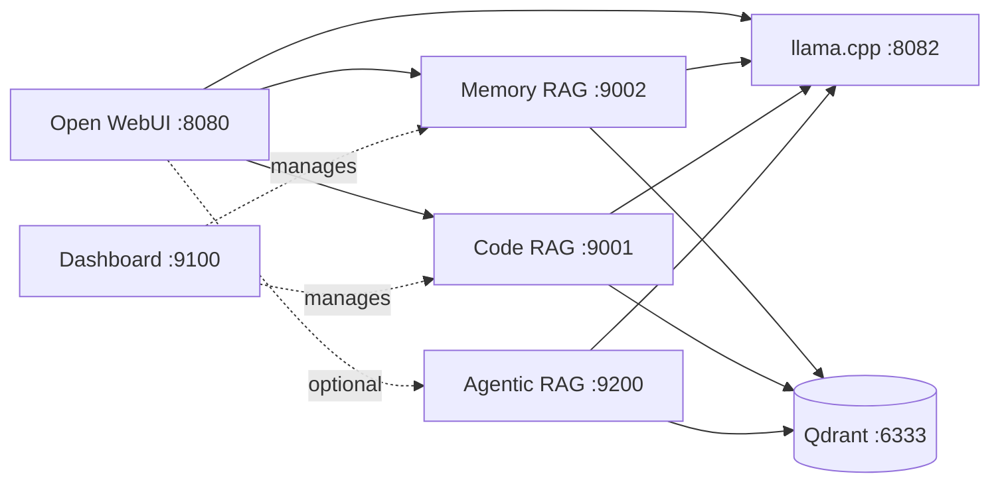

# AI Stack VM

AI Stack VM is a self-hosted local AI environment for llama.cpp model serving,
Open WebUI, Qdrant, and retrieval over private engineering notes and source code.
The installer detects the host, selects a safe PyTorch embedding backend, checks
storage, downloads a GGUF model, and verifies the running stack.

## Quick Start

Requirements: Linux with Docker and the Docker Compose plugin, or Podman for
CPU mode; plus `git`, `curl`, and `awk`.

```bash
git clone <repository-url> ai-stack-vm
cd ai-stack-vm
chmod +x ./ai-stack
./ai-stack install --compute auto
```

Use an explicit mode when needed:

```bash
./ai-stack install --compute cpu   # portable, smallest images
./ai-stack install --compute gpu   # NVIDIA + Docker; fails if GPU access is unusable
```

`auto` chooses NVIDIA acceleration only after host detection and a successful
Docker GPU probe. Every uncertain or failed GPU check falls back to CPU and
prints the reason. CPU remains the default image backend.

## Architecture



The embedding services use installer-selected PyTorch CPU/CUDA wheels.
`vm-llama` remains independently CPU-configured in this release.

## What the Installer Does

The installer runs ten visible stages with `OK`, `WARN`, `FAIL`, or `SKIP`
outcomes:

```text
[1/10] Checking host prerequisites
[2/10] Detecting hardware
[3/10] Selecting compute backend
[4/10] Selecting AI model
[5/10] Checking storage requirements
[6/10] Preparing configuration
[7/10] Preparing model
[8/10] Building containers
[9/10] Starting services
[10/10] Running verification
```

It detects OS/architecture, CPU, RAM, both runtime and container filesystems,
container engine/Compose, service ports, NVIDIA GPU/VRAM/driver, runtime
registration, and actual container GPU visibility. Existing `.env` files are
backed up before changes.

See [Installation](docs/setup/installation.md),
[hardware detection](docs/setup/hardware-detection.md), and
[NVIDIA GPU setup](docs/setup/gpu-installation.md).

## Service URLs

| Service | URL | Default exposure |
|---|---|---|
| Open WebUI | `http://localhost:8080` | all interfaces |
| llama.cpp API | `http://localhost:8082/v1` | localhost |
| Qdrant | `http://localhost:6333` | localhost |
| Code RAG | `http://localhost:9001/v1` | localhost |
| Memory RAG | `http://localhost:9002/v1` | localhost |
| Dashboard | `http://localhost:9100` | optional, all interfaces |
| Agentic RAG | `http://localhost:9200/v1` | optional, localhost |

## Common Commands

```bash
./ai-stack hardware
./ai-stack compute status
./ai-stack compute auto|cpu|gpu
./ai-stack doctor
./ai-stack model add
./ai-stack build
./ai-stack up
./ai-stack status
./ai-stack dashboard
./ai-stack agentic-rag up
./ai-stack index memory
./ai-stack index code <repo-path>
./ai-stack logs all
./ai-stack down
```

All existing profile, model, search, smoke, Qdrant, benchmark, and demo commands
remain available. See the [complete CLI reference](docs/cli/ai-stack.md).

## Compute Selection

Configuration is installer-managed in `.env`:

```env
COMPUTE_MODE=auto
PYTORCH_BACKEND=cpu
EMBEDDING_DEVICE=cpu
```

The versioned matrix supports `cpu`, `cu126`, `cu130`, and `cu132` with pinned
PyTorch 2.12.1. Auto mode selects the highest backend whose minimum CUDA level
does not exceed the compatibility reported by `nvidia-smi`. GPU mode requires
Linux x86_64, Docker Compose, a working NVIDIA driver/toolkit, and a successful
`ubuntu:24.04` container probe. Podman remains supported in CPU mode.

Only embedding services receive GPU reservations: memory/code proxies,
dashboard/indexer, and Agentic RAG. Qdrant, Open WebUI, and `vm-llama` do not.

## Storage Policy

The installer probes the remote model size, accounts for a partial download,
and checks both `$AI_STACK_HOME` and the container-engine storage root.

- Runtime filesystem: remaining model bytes + 10 GiB minimum / 20 GiB recommended.
- Container filesystem: CPU 10/15 GiB; GPU 20/30 GiB minimum/recommended.
- When both paths share a filesystem, requirements are added together.

Below minimum fails before download. Between minimum and recommended warns and
continues. Custom models require a successful size probe or
`MODEL_EXPECTED_SIZE_GB`. See [Runtime storage](docs/setup/runtime-storage.md).

## Security

Model, database, and RAG ports bind to `127.0.0.1` by default. Open WebUI and the
dashboard have separate bind variables and default to `0.0.0.0` for VM use.
Before exposing them beyond a trusted network, enable production mode, set a
strong API key/dashboard credentials, and place HTTPS in front of the services.
Never commit `.env`, model files, private indexed content, or credentials.

See [Production hardening](docs/security/production-hardening.md).

## Manual and Standalone Builds

Normal users should use `./ai-stack build`. Individual CPU targets remain
self-contained and never require a local `ai-stack/base-deps` image:

```bash
docker build --build-arg PYTORCH_BACKEND=cpu -f docker/Dockerfile.rag-services --target memory-proxy -t ai-stack/memory-proxy .
docker build --build-arg PYTORCH_BACKEND=cpu -f docker/Dockerfile.rag-services --target code-proxy -t ai-stack/code-proxy .
docker build --build-arg PYTORCH_BACKEND=cpu -f docker/Dockerfile.rag-services --target agentic-rag -t ai-stack/agentic-rag .
docker compose -f docker-compose.memory-proxy.yml build memory-proxy
docker compose -f docker-compose.code-proxy.yml build code-proxy
docker compose -f docker-compose.agentic-rag.yml build agentic-rag
```

Standalone Compose manifests are intentionally CPU-safe. GPU overlays are
applied through `./ai-stack` after compute resolution.

## Repository Map

```text
ai-stack                         operator CLI
config/pytorch-backends.conf     authoritative PyTorch backend matrix
requirements/                    neutral and test dependencies (no Torch pin)
scripts/install-python-dependencies.sh
scripts/lib/                     compute, hardware, environment, Compose helpers
docker/Dockerfile.rag-services   memory/code/agentic named targets
docker/Dockerfile.dashboard      dashboard and indexer image
docker-compose*.yml              base manifests and scoped GPU overlays
src/ai_stack_rag/                modular RAG package
tests/                           shell and Python regression tests
docs/                            detailed operator/developer guides
```

## Documentation

- [Documentation home](docs/README.md)
- [Installation](docs/setup/installation.md)
- [Configuration](docs/setup/configuration.md)
- [Architecture](docs/architecture/README.md)
- [API reference](docs/api/README.md)
- [Operations and troubleshooting](docs/operations/README.md)
- [Security](docs/security/README.md)
- [Examples](docs/examples/README.md)
- [Contributing](CONTRIBUTING.md)

## Developer Validation

```bash
bash -n ai-stack scripts/install-python-dependencies.sh scripts/lib/*.sh tests/test_compute.sh
bash tests/test_compute.sh
python scripts/validate_compute_config.py
python -m unittest discover -s tests
python scripts/check_markdown_refs.py
cd scripts/dashboard/frontend && npm run typecheck
```

The developer performs Docker builds and the final frontend build. A manually
triggered GitHub Actions workflow validates all fresh-cache CPU image targets,
asserts CPU-only Torch, rejects `nvidia-*` packages, and reports image sizes.
