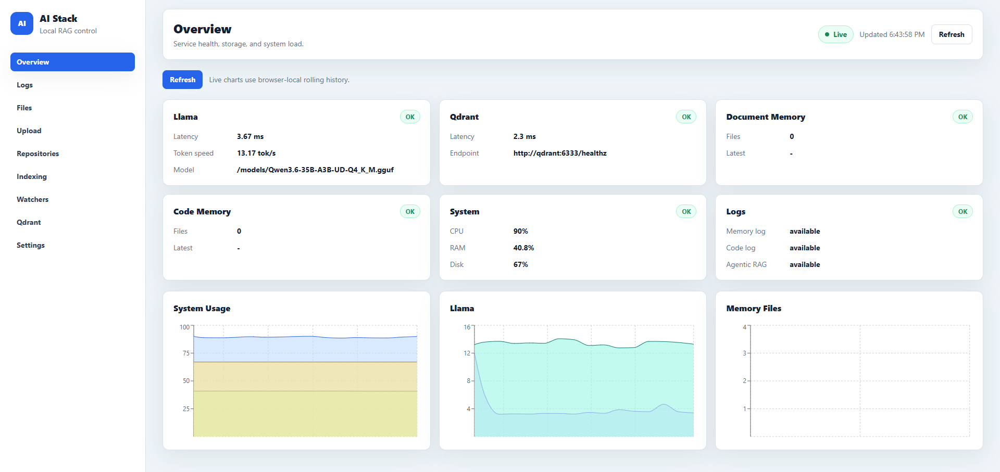
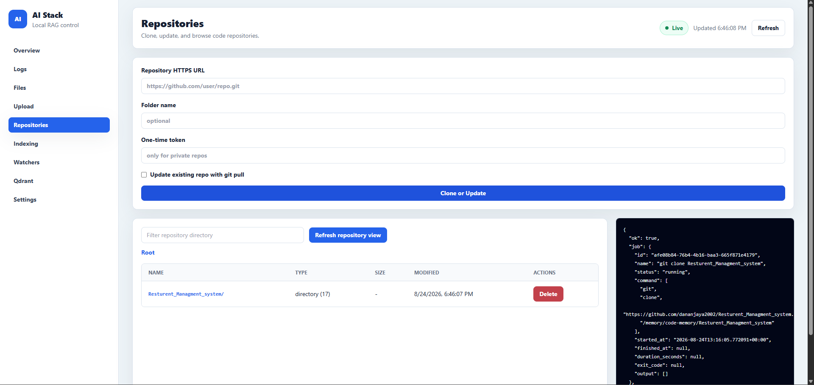
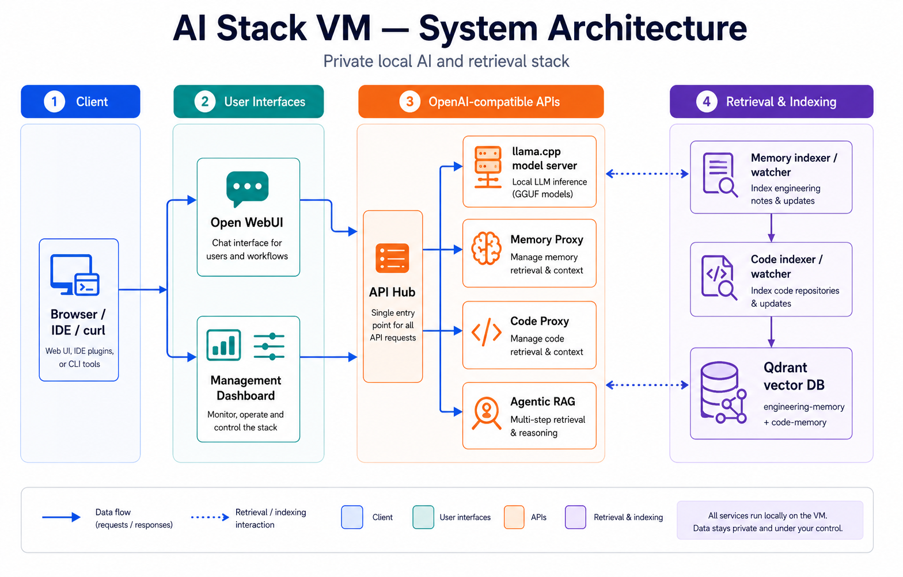

# AI Stack VM

Self-hosted local AI and retrieval infrastructure for private engineering
knowledge and source-code repositories.

AI Stack VM combines llama.cpp, Open WebUI, Qdrant, code and document RAG, and
a management dashboard in one operator-friendly stack. It supports CPU-only
hosts and NVIDIA GPU acceleration while keeping models and indexed data under
your control.

> [Watch the demo video and view the project showcase](https://kavishanportfolio.vercel.app/?project=ai-stack-vm#projects)

## Highlights

- Run GGUF language models locally through an OpenAI-compatible API.
- Chat through Open WebUI or connect an IDE, application, or CLI client.
- Index Markdown engineering notes and supported source-code repositories.
- Keep indexes current with automatic memory and repository watchers.
- Clone, update, browse, index, and remove repositories from the dashboard.
- Store semantic vectors in separate Qdrant collections for memory and code.
- Install on CPU systems or use NVIDIA acceleration when available.
- Add compatible custom GGUF models through the interactive CLI.

## Dashboard

The management dashboard provides service health, system usage, logs, file
uploads, repository management, indexing controls, watcher status, Qdrant
information, and runtime settings.



### Repository management

Repositories can be cloned or updated from an HTTPS URL, browsed directly in
the dashboard, and indexed into code memory.



## Quick start

### Requirements

- Linux
- Docker Engine with the Docker Compose plugin
- `git`, `curl`, and `awk`
- Optional NVIDIA GPU, driver, and container toolkit for GPU mode

Podman is also supported for CPU installations.

### Install

```bash
git clone https://github.com/dananjaya2002/ai-stack-vm.git
cd ai-stack-vm
chmod +x ./ai-stack
./ai-stack install --compute auto
```

`auto` uses NVIDIA acceleration only when the host and container checks pass;
otherwise it safely selects CPU mode. You can also choose a mode explicitly:

```bash
./ai-stack install --compute cpu
./ai-stack install --compute gpu
```

After installation, open Open WebUI at `http://localhost:8080`. Start the
optional management dashboard with:

```bash
./ai-stack dashboard
```

Then open `http://localhost:9100`.

See the [installation guide](docs/setup/installation.md) for prerequisites,
verification, and first-use instructions.

## Architecture



The browser, IDE, or CLI communicates with Open WebUI or the management
dashboard. OpenAI-compatible services route requests to the local llama.cpp
model server and retrieve relevant context from Qdrant. Dedicated indexers and
watchers keep engineering memory and repository code searchable.

All services run locally on the VM. Models, source code, notes, and vector data
remain under the operator's control.

## Services

| Service | Default URL | Purpose |
|---|---|---|
| Open WebUI | `http://localhost:8080` | Chat and workflow interface |
| Dashboard | `http://localhost:9100` | Stack management and monitoring |
| llama.cpp API | `http://localhost:8082/v1` | Local model inference |
| Memory RAG | `http://localhost:9002/v1` | Engineering-memory retrieval |
| Code RAG | `http://localhost:9001/v1` | Repository-code retrieval |
| Qdrant | `http://localhost:6333` | Vector storage |
| Agentic RAG | `http://localhost:9200/v1` | Optional multi-step retrieval |

Model, database, and RAG endpoints bind to localhost by default. Open WebUI and
the dashboard are intended for VM access and must be hardened before exposure
to an untrusted network.

## Common commands

```bash
./ai-stack status
./ai-stack doctor
./ai-stack hardware
./ai-stack dashboard
./ai-stack model add
./ai-stack index memory
./ai-stack index code <repo-path>
./ai-stack logs all
./ai-stack down
```

See the [complete CLI reference](docs/cli/ai-stack.md) for all commands.

## Data locations

Runtime data is stored outside the repository under `AI_STACK_HOME`:

```text
$AI_STACK_HOME/
├── models/
└── memory/
    ├── engineering-memory/
    └── code-memory/
```

Qdrant and Open WebUI data are stored in Docker volumes. Do not commit models,
private notes, indexed repositories, `.env`, or credentials.

## Documentation

- [Documentation home](docs/README.md)
- [Installation](docs/setup/installation.md)
- [Configuration](docs/setup/configuration.md)
- [Architecture](docs/architecture/README.md)
- [CLI reference](docs/cli/README.md)
- [API reference](docs/api/README.md)
- [Operations and troubleshooting](docs/operations/README.md)
- [Security](docs/security/README.md)
- [Examples](docs/examples/README.md)
- [Contributing](CONTRIBUTING.md)

## Security

Before exposing the stack beyond a trusted network, enable production mode,
configure strong API and dashboard credentials, restrict network access, and
place HTTPS in front of public services. See
[production hardening](docs/security/production-hardening.md).

## Development validation

The project includes lightweight syntax, configuration, Markdown-reference,
Python, shell, and dashboard checks. The developer performs final container and
frontend builds manually; see [CONTRIBUTING.md](CONTRIBUTING.md) for the current
validation workflow.
